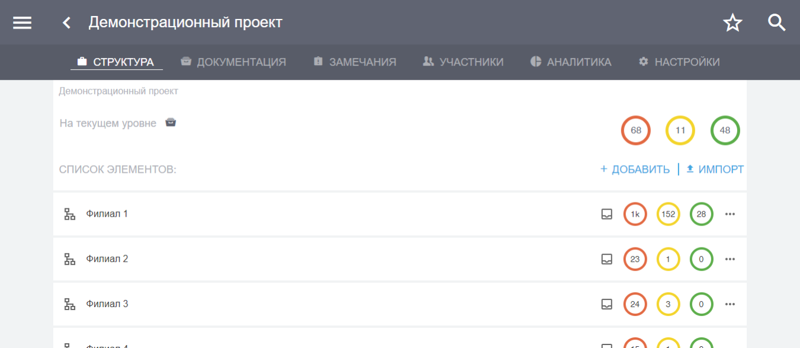

Начало работы с программным комплексом и Вход в систему
=======================================================

Начало работы с программным комплексом
--------------------------------------

Программный комплекс состоит из серверной части, веб-интерфейса и мобильных приложений.

Вы можете открыть веб-приложение в браузере по адресу app.plotpad.com или просто перейдите по `ссылке <https://app.plotpad.com>`_.

..  only:: html

    Мобильные приложения можно скачать по ссылкам:

    *   |PlayMarket|,
    *   |AppStore|.

..  |PlayMarket| raw:: html
    
    <a href="https://play.google.com/store/apps/details?id=com.planstery.review&hl=ru" target="_blank">PlayMarket</a>

..  |AppStore| raw:: html

    <a href="https://apps.apple.com/ru/app/стройконтоль/id867522092" target="_blank">AppStore</a>

..  only:: latex

    Мобильные приложения можно скачать по ссылкам:

    *   `PlayMarket <https://play.google.com/store/apps/details?id=com.planstery.review&hl=ru>`_,
    *   `AppStore <https://apps.apple.com/ru/app/стройконтоль/id867522092>`_.

Серверная часть отвечает за хранение и обработку данных и находится в безопасном дата-центре провайдера **Selectel**.

..  _login:

Вход в систему
--------------

Интерфейс пользователя доступен всем участникам проекта. 
В нем осуществляется работа непосредственно с проектом, проектной документацией, замечаниями, предписаниями, отчетами и др. 
Для входа в интерфейс пользователя:

*   на персональном компьютере пройдите по ссылке из прошлого пункта,
*   на планшете/смартфоне установите по ссылкам из прошлого пункта приложение «СтройКонтроль» и запустите его.

Для входа в приложение введите свой e-mail, пароль и нажмите кнопку «Войти» (Рис. 1).

..  figure:: ./images/installing-and-login-1-first-screen.gif
    :alt: Первый экран
    :align: center

    Рис. 1. Вход в интерфейс пользователя

После этого вы попадете в интерфейс пользователя (Рис. 2).

    Рис. 2. Интерфейс пользователя. Общий вид.

Данные --- e-mail и пароль --- для доступа в интерфейс пользователя предоставляется *администратором системы*.
Всю первоначальную настройку программы, ввод необходимых для работы данных,
создание проектов, структуры и документов производит только администратор системы.

..  note:: Администратор системы – это сотрудник клиента, имеющий расширенные права на работу с
            программным комплексом «СтройКонтроль».
            
            Он имеет право создавать проекты, структуру, загружать документацию по проекту,
            создавать пользователей и наделять их правами, создавать и присуждать сотрудникам роли на проекте и производить прочие настройки.
            По всем вопросам работы в программном комплексе обращайтесь к администратору системы.

