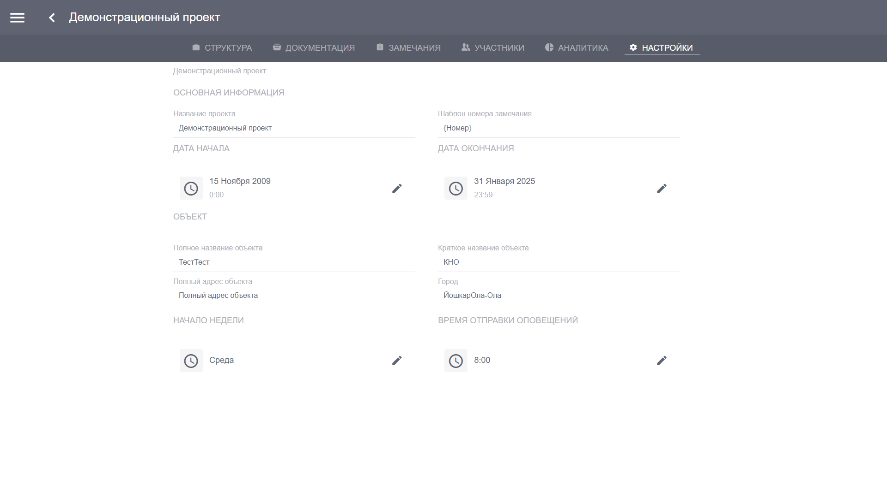

Раздел "Настройки"
==================

Рассмотрим раздел «Настройки» в конкретном элементе структуры/проекте (Рис. 1).

В нем необходимо указать информацию по конкретному проекту:

*   название проекта/элемента структуры,
*   шаблон номера замечания,
*   дата начала работ,
*   дата окончания работ,
*   полное название объекта,
*   краткое название объекта,
*   полный адрес объекта,
*   город местонахождения объекта,
*   начало рабочей недели на объекте,
*   время отправки оповещений.

    Рис. 1. Раздел «Настройки»

..  attention:: Вся информация из раздела «Настройки» будет автоматически распространяться на все «подэтапы» структуры.
    Например, нельзя в подэтапе назначить дату начала раньше, чем дата начала самой работы.

На основании настройки времени отправки оповещений программа создаст рассылку уведомлений.
На электронные адреса заявленных участников будут приходить письма-уведомления.

Также в этом разделе можно изменить название элемента структуры и задать шаблон нумерации замечаний.
