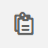
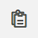

Инструменты для работы на плане
===============================

Откройте необходимый вам чертеж.
В правом верхнем углу доступны две панели с инструменты для работы с чертежом (Рис. 1).

    Рис. 1. Чертеж с панелями инструментов

На верхней панели расположены управляющие элементы, а на правой --- выделяющие.

Панель с управляющими элементами
--------------------------------

..  figure:: images/plans-instruments/plans-instrument-2-manage-panel.png
    :alt: Панель с управляющими элементами
    :align: center

Рассмотрим каждый инструмент на панели:

#.  |Genplan-Button| --- работа с Генпланом. Позволяет преобразовать чертеж в Генплан. Описание работы функционала в следующем разделе.
#.  |Favorite-Button| --- добавление в избранное. После нажатия на эту кнопку чертеж будет добавлен в раздел «Избранное». 
#.  |Task-Registry-Button| --- реестр замечаний. Нажатие кнопки переместит вас в реестр замечаний, относящихся к данному чертежу.
    Нажав на любое замечание, вы можете перейти к его редактированию.
#.  |Layers-Button| --- слои. При нажатии кнопки «Слои» открывается меню выбора слоев для последующего отключения/включения.
 
    У всех планов можно отключить **слой аннотаций** --- это слой нарисованных фигур на плане: линий, кругов, стрелок и тому подобное, ---
    и слой замечаний (Рис. 2). Для DWF-чертежей, в которых сохранились слои плана, есть доступ к включению и выключению некоторых из них.

    ..  figure:: images/plans-instruments/plans-instrument-6-manage-panel-layers.png
        :alt: Работа со слоями
        :align: center
        
        Рис. 2. Работа со слоями

#.  |Settings-Button| --- настройки плана. Позволяет перейти в настройки чертежа (Рис. 3).

    ..  figure:: images/plans-instruments/plans-instrument-7-manage-panel-settings.png
        :alt: Настройки чертежа
        :align: center
        
        Рис. 3. Окно настроек чертежа.

#.  |Exit-Button| --- закрыть чертеж.

Панель с выделяющими элементами
-------------------------------

Панель справа состоит из 6 кнопок (Рис. 4):

..  figure:: images/plans-instruments/plans-instrument-9-selection-panel.png
    :alt: Работа со слоями
    :align: center

    Рис. 4. Инструменты для работы с чертежом.

#.  |Selection-Button| --- режим выделения. Позволяет выделить несколько замечаний и аннотаций на чертеже.
    Необходим для совершения действия сразу с несколькими элементами на чертеже (Рис. 5).

    ..  only:: html

        ..  figure:: images/plans-instruments/plans-instrument-10-selection-panel-selection.gif
            :alt: Работа со слоями
            :align: center

            Рис. 5. Панель выделения.

    ..  only:: latex

        ..  figure:: images/plans-instruments/plans-instrument-10-selection-panel-selection.png
            :alt: Работа со слоями
            :align: center

            Рис. 5. Панель выделения.

#.  |Choose-Button| --- режим выбора. Позволяет перемещать чертеж на экране, выбирать и открывать контекстное меню замечания.
#.  |Scale-Button| --- масштабирование. Позволяет изменить масштаб чертежа.
    Вам доступно несколько заданных коэффициентов увеличения и приближения:
    50%, 100%, 150%, 200% и **Fit** --- масштабирование размера чертежа в соответствие с размером экрана устройства --- (Рис. 6).

    ..  figure:: images/plans-instruments/plans-instrument-12-selection-panel-scale.png
        :alt: Масштабирование
        :align: center

        Рис. 6. Заданные коэффициенты масштабирование.

#.  |Drawing-Button| --- рисование фигур. При нажатии на данную кнопку программа предложит пользователю
    набор инструментов для создания меток (Рис. 7):
    
    *   стрелка,
    *   линия,
    *   прямоугольник,
    *   круг,
    *   крест,
    *   ручка (свободное рисовании),
    *   облако,
    *   текст на чертеже.

    ..  figure:: images/plans-instruments/plans-instrument-13-selection-panel-drawing.png
        :alt: Метки
        :align: center

        Рис. 7. Набор инструментов для создания меток

    После выбора любого инструмента, внизу всей панели появляются две дополнительные кнопки:
    
    *   |Width-Button| --- настройка толщины линии,

        ..  figure:: images/plans-instruments/plans-instrument-10-selection-panel-width.png
            :alt: Толщина линии
            :align: center

            Рис. 8. Настройка толщины линии

    *   |Color-Button| --- настройка цвета.

        ..  figure:: images/plans-instruments/plans-instrument-10-selection-panel-color.png
            :alt: Толщина линии
            :align: center

            Рис. 9. Настройка цвета

#.  |Measurements-Button| --- измерения. Позволяет измерить, отметить, задать расстояния между объектами.
    Символ на кнопке меняется в зависимости от последнего используемого инструмента (Рис. 10).

    ..  figure:: images/plans-instruments/plans-instrument-14-selection-panel-measurements.png
        :alt: Работа со слоями
        :align: center

        Рис. 10. Набор инструментов для измерения

#.  |Tasks-Button| --- работа с замечаниями. При двойном нажатии появляется следующая панель работы с замечанием: 

    ..  figure:: images/plans-instruments/plans-instrument-15-selection-panel-tasks.png
        :alt: Работа со слоями
        :align: center

        Рис. 11. Панель замечаний

    *   |Tasks-Creating-Button| --- создает замечание. 
    *   |Tasks-Bim-Button| --- доступна только при работе с BIM моделями. Позволяет создать замечание в BIM-модели.
    *   |Tasks-Clone-Button| --- кнопка клонирования замечаний. Позволяет копировать однотипные замечания.
        
        Например, на всем объекте нарушена технология крепления железобетонных плит.
        Для этого создайте и опишите замечание на плане по одной плите.
        
        Далее --- нажмите на это замечание, нажмите на кнопку «клонировать» |Tasks-Clone-Button| и отметьте на плане в новом месте.
        Появится замечание со всеми ранее введенными данными, кроме комментариев, приложений и истории.

Все созданные замечания можно удалить прямо на чертеже, предварительно выделив их |Selection-Button| и нажав на кнопку «Удалить», если у вас есть на это права.

..  |Genplan-Button| image:: images/plans-instruments/plans-instrument-3-manage-panel-genplan.png
            :alt: Генплан
            :scale: 70%

..  |Task-Registry-Button| image:: images/plans-instruments/plans-instrument-5-manage-panel-tasks-registry.png
            :alt: Реестр замечаний
            :scale: 70%

..  |Exit-Button| image:: images/plans-instruments/plans-instrument-8-manage-panel-exit.png
            :alt: Выход из чертежа
            :scale: 70%

..  |Scale-Button| image:: images/plans-instruments/plans-instrument-12-selection-panel-scale-button.png
            :alt: Выход из чертежа
            :scale: 70%
            
..  |Drawing-Button| image:: images/plans-instruments/plans-instrument-13-selection-panel-drawing-button.png
            :alt: Выход из чертежа
            :scale: 70%

..  |Color-Button| image:: images/plans-instruments/plans-instrument-10-selection-panel-color-button.png
            :alt: Выбор цвета
            :scale: 70%

..  |Measurements-Button| image:: images/plans-instruments/plans-instrument-14-selection-panel-measurements-button.png
            :alt: Измерения
            :scale: 70%

