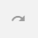

Создание замечаний
==================

Если вы представитель службы заказчика, технадзора или другой уполномоченный создавать замечания в проекте, вам доступна функция фиксации замечаний.
Замечания могут быть созданы двумя способами.

Краткая карточка замечания
--------------------------

Ряд замечаний на строительном объекте не требуют привязки к плану, чертежу.
**Например**, замечание руководителя строительного контроля инженеру по приёмке некачественного материала.

Также это могут быть поручения: произвести фотофиксацию журнала работ и многое другое.

Для создания замечания без привязки к плану в разделе **Замечания** нажмите на синюю кнопку |Add-Button| в правом нижнем углу экрана (Рис. 1).
После этого откроется краткая форма карточки замечания.

..  |Add-Button| image:: images/tasks-creating/tasks-creating-1-add-button.png
            :alt: Добавить замечание
            :scale: 30%

..  only:: html

    ..  thumbnail:: images/tasks-creating/tasks-creating-2-adding-task.gif
        :alt: Добавить документацию
        :align: center
        :title: Рис. 1. Создание замечания без привязки к плану
        :show_caption: True

..  only:: latex

    ..  figure:: images/tasks-creating/tasks-creating-2-adding-task.png
        :alt: Добавить документацию
        :align: center

        Рис. 1. Создание замечания без привязки к плану

Развёрнутый вид карточки показан ниже (Рис. 2):

..  thumbnail:: images/tasks-creating/tasks-creating-3-full-task-view.png
    :alt: Добавить документацию
    :width: 70%
    :title: Рис. 2. Развёрнутый вид краткой карточки замечания
    :show_caption: True

Заполните всю информацию по замечанию, которая доступна на данный момент:

#.  **Выбрать шаблон**. Данная функция позволяет заполнять поля **Название** и **Описание** типовыми формулировками.

    Например, текстом из нормативно-технической документации или любым другим текстом,
    в зависимости от того, как эту функцию настроит функциональный администратор системы.

    При заполнении данного пункта достаточно ввести ключевые слова, программа сама предложит вам варианты нормативных документов (Рис. 3).
    Выберите нужный для заполнения замечания стандарт.

    ..  thumbnail:: images/tasks-creating/tasks-creating-4-choose-sample.gif
        :alt: Добавить документацию
        :align: center
        :title: Рис. 3. Поиск нормативного документа, по ключевым словам, в пункте "Выбрать шаблон"
        :show_caption: True

    Чтобы изменить пункт стандарта, нажмите на кнопку “Выбрать шаблон” и повторите действия, описанные выше.
    Можно отредактировать предложенный программой текст вручную.

#.  **Название**. Придумайте название для вашего замечания. Название и вся информация в данном разделе должна быть максимально точной,
    она будет автоматически включена в предписание и отчет.
#.  **Описание**. Подробно опишите замечание.

#.  **Категории**. Некий идентификатор, который присваивается замечанию и по которому можно задать фильтр для поиска.
    Список категорий настраивается в административной панели.

#.  **Исполнитель**. Представитель компании, отвечающий за выполнение работ по устранению данного замечания.

#.  **Срок устранения**. На усмотрение автора замечания. Может быть скорректирован по договоренности с исполнителем.

#.  **Файлы**. Программа позволяет добавить/создать неограниченное количество фотографий и любых других файлов: docx, pdf и прочие.
    Если при создании фотографии включены настройки геолокации в программе и на устройстве, то геолокация автоматически прикрепляется к фотографии.

    Координаты геолокации будут находиться под фотографией, по ним можно перейти на Карты Google и увидеть местоположение замечания.
    Если в этом нет необходимости, то геолокацию можно отключить.
    
    Рекомендуем делать фотографии нарушений **до устранения и после**.
    А также скан-копии подписанных предписаний и актов об устранении.

..  note::  Краткая форма позволяет быстро зафиксировать основные моменты нарушения.
            Далее вы можете остаться в списке замечаний нажав на кнопку “Создать”
            или перейти в детальное заполнение замечания нажав “Создать и открыть”.

            Дальнейшее редактирование и наполнение замечания можно продолжить в офисе. Это сэкономит время работы на объекте.

Полная форма карточки замечания
-------------------------------

При нажатии на ранее созданное замечание или кнопки "Создать и открыть" в краткой карточке откроется полная форма карточки замечания.

Она содержит следующие вкладки (Рис. 4):

#.  **Главная**. Содержит основную информацию о замечании (название, описание, срок устранения, ФИО исполнителя и т.д.).
#.  **Файлы**. Просмотр ранее загруженных фото\видео со строительной площадки и загрузка новых файлов
#.  **Документы**. Просмотр и скачивание сформированных документов на данное замечание (предписание, акты)
#.  **История**. История действий, произведённых в программе.
#.  **Комментарии**. Переписка пользователей по замечаниям.

..  thumbnail:: images/tasks-creating/tasks-creating-5-opened-task.png
    :alt: Добавить документацию
    :width: 90%
    :title: Рис. 4. Общий вид карточки замечания
    :show_caption: True 

Вкладка "Главная"
+++++++++++++++++

#.  **Архивировать**. Кнопка позволяет удалить замечание.
#.  **Важное** |Important-Button|. Кнопка присваивает замечанию статус важное и поднимает замечание в реестре замечаний наверх.
#.  **Избранное**. Кнопка добавляет замечание в список избранных.
#.  **Сформировать документ**. Сформировать документ (предписание, акт, отчёт) по данным из карточки замечания.
#.  **Закрыть**. Закрывает карточку замечания.
#.  **Состояние**. Доступно три статуса замечания: открыт, выполнен, проверен. Статус меняют по ходу устранения замечания:
    
    #.  Статус **«Открыто»** присваивает автор замечания, например, сотрудник строительного контроля, данный статус присваивается автоматически при создании замечания.
    #.  Статус **«Устранено»** присваивает сотрудник, отвечающий за исправление замечания.
    #.  Статус **«Закрыто»** присваивает сотрудник, контролирующий устранение замечания.

#.  **Выбрать план**. Прикрепление замечания к чертежу.
#.  **Выбрать шаблон**. Данная функция позволяет заполнять поля Название и Описание типовыми формулировками.
#.  **Номер**. Номер замечания выдаётся программой автоматически.
#.  **Название**. Придумайте название для вашего замечания. Название и вся информация в данном разделе должна быть максимально точной, она будет автоматически включена в предписание и отчет.
#.  **Описание**. Подробно опишите замечание.
#.  **Местоположение**. В данной строке можно указывать названия осей или локацию, к которой относится замечание.
#.  **Предложение по устранению**. В этом поле вы можете написать свои рекомендации по устранению нарушения.
#.  **Категории**. Некий идентификатор, который присваивается замечанию и по которому можно задать фильтр для поиска. Список категорий настраивается в административной панели.
#.  **Ответственный**. ФИО пользователя контролирующего устранения замечания. По умолчанию заполняется ФИО пользователя, создавшим замечание.
#.  **Исполнитель**. Представитель компании, отвечающий за выполнение работ по устранению данного замечания.
#.  **Срок устранения**. На усмотрение автора замечания. Может быть скорректирован по договоренности с исполнителем.
#.  **Наблюдатели**. В этом поле вы можете указать участников, которых необходимо дополнительно информировать о ходе устранения нарушения, например, начальника технического надзора. Таких участников может быть несколько.
#.  **Фактическая дата устранения**. Проставляется автоматически при смене статуса замечания на «Проверено».
#.  **Дата отчетности**. В этом поле вы можете указать дату, которая будет указана в предписании. Можно редактировать.

Развёрнутый вариант заполненной карточки вы можете посмотреть ниже (Рис. 5):

..  thumbnail:: images/tasks-creating/tasks-creating-6-full-view-in-main.png
    :alt: Добавить документацию
    :align: center
    :title: Рис. 5. Развёрнутый вариант заполненной вкладки "Главное"
    :show_caption: True

Вкладка "Файлы"
+++++++++++++++

Здесь вы сможете загрузить удалить или отредактировать ранее загруженные файлы. Загрузка и удаление показано ниже (Рис. 6):

..  thumbnail:: images/tasks-creating/tasks-creating-7-full-view-in-files.png
    :alt: Добавить документацию
    :align: center
    :title: Рис. 6. Загрузка/удаление файлов
    :show_caption: True

..  only:: html

    Также на вложения можно добавлять аннотации. 
    Для этого откройте загруженную в приложение фотографию и нажмите на значок |Drawing-Annotation-Button|.
    После этого появится меню с инструментами для рисования (Рис. 4)

    ..  thumbnail:: images/tasks-creating/tasks-creating-3-drawing-annotation.gif
        :alt: Добавить документацию
        :align: center
        :title: Рис. 7. Рисование аннотаций
        :show_caption: True

..  only:: latex

    Также на вложения можно добавлять аннотации. 
    Для этого откройте загруженную в приложение фотографию и нажмите на значок |Drawing-Annotation-Button| (Рис. 4).

    ..  figure:: images/tasks-creating/tasks-creating-3-drawing-annotation.png
        :alt: Рисование аннотаций
        :align: center
        
        Рис. 7. Рисование аннотаций

    Появится меню с инструментами для рисования.

    ..  figure:: images/tasks-creating/tasks-creating-4-drawing-panel.png
        :alt: Панель аннотаций
        :align: center

    Приближённая версия:

    ..  image:: images/tasks-creating/tasks-creating-5-drawing-panel-close.png
        :alt: Панель аннотаций близко
        :align: center

Рассмотрим каждый инструмент отдельно:

*   |Moving-Button| --- перемещение по снимку,
*   |Text-Button| --- добавление текста,
*   |Line-Button| --- добавление произвольных линий,
*   |Straight-Line-Button| --- добавление прямых линий,
*   |Rectangle-Button| --- добавление прямоугольной области,
*   |Circle-Button| --- добавление круглой области,
*   |Arrow-Button| --- добавление стрелки,
*   |Color-Button| --- выбор цвета линий,
*   |Line-Width-Button| --- выбор толщины линий,
*   |Undo-Button| --- отменить последнее действие,
*   |Redo-Button| --- вернуть последнее изменение,
*   |Accept-Button| --- применить аннотации к фотографии,

После того, как вы нарисуете требуемые аннотации, фотография будет отправлена на дозагрузку нарисованных изображений.

Вкладка "Комментарии"
+++++++++++++++++++++

В самом замечании можно вести переписку между назначенными на данное замечание сотрудниками и всеми пользователями программы,
обладающими правами на это.

Пользователь, в зависимости от настройки прав либо не сможет отредактировать данный раздел,
либо:

*   может удалить из переписки свои сообщения,
*   может удалить и свои, и чужие сообщения.

Для удаления необходимо нажать правой кнопкой мыши на комментарий , который вы хотите удалить,
а затем подтвердить удаление в новом окне (Рис. 8).

..  thumbnail:: images/tasks-creating/tasks-creating-8-comments.gif
    :alt: Добавить документацию
    :align: center
    :title: Рис. 8. Работа с комментариями
    :show_caption: True

Создание замечания на чертеже. Работа с чертежами.
--------------------------------------------------

Этот способ удобен для создания замечаний, которые можно показать на плане. Например, трещина в стене, коррозия арматуры и подобное.
В случае создания замечания на чертеже оно прикрепляется к конкретному месту на чертеже.

Чтобы создать замечание на чертеже:

..  only:: html

    #.  Откройте чертеж, нажмите на красную кнопку в правой рабочей области экрана |Creating-Task-On-Plan-Button| (Рис. 9).

        ..  thumbnail:: images/tasks-creating/tasks-creating-26-creating-task-on-plan.gif
            :alt: Замечание на чертеже
            :align: center
            :title: Рис. 9. Создание замечания на чертеже
            :show_caption: True

..  only:: latex

    #.  Откройте чертеж, нажмите на красную кнопку в правой рабочей области экрана |Creating-Task-On-Plan-Button| (Рис. 9).

        ..  figure:: images/tasks-creating/tasks-creating-26-creating-task-on-plan.png
            :alt: Замечание на чертеже
            :align: center

            Рис. 9. Создание замечания на чертеже

2.  Наведите курсор мыши на место на плане, где было выявлено нарушение, и нажмите на левую кнопку мыши для отметки.
    На сенсорном экране вашего смартфона/планшета нажмите на место на чертеже.
    
    Появится знак замечания |Task-Marker|, и автоматически откроется краткая форма создания замечания.
    Приступите к заполнению информации по замечанию, как уже было описано ранее.

..  only:: html

    Если Вы хотите повторно попасть в описание замечания, нажмите левой кнопкой мыши на замечание на чертеже.
    Далее нажмите на кнопку |Next-Button| (Рис. 10).

    ..  thumbnail:: images/tasks-creating/tasks-creating-31-open-full-form-from-plan.gif
        :alt: Открытие полной карточки
        :align: center
        :title: Рис. 10. Открытие полной карточки замечания через чертёж
        :show_caption: True

..  only:: latex
    
    Если Вы хотите повторно попасть в описание замечания, нажмите левой кнопкой мыши на замечание на чертеже.
    Далее нажмите на кнопку |Next-Button| (Рис. 10).

    ..  figure:: images/tasks-creating/tasks-creating-31-open-full-form-from-plan.png
        :alt: Открытие полной карточки
        :align: center
    
        Рис. 10. Открытие полной карточки замечания через чертёж

Для повторного открытия замечания на смартфоне/планшете на сенсорном экране нажмите на замечание, далее на кнопку |Next-Button|.

..  |Drawing-Annotation-Button| image:: images/tasks-creating/tasks-creating-3-drawing-annotation-button.png
            :alt: Перемещение
            :scale: 100%

..  |Moving-Button| image:: images/tasks-creating/tasks-creating-6-moving-button.png
            :alt: Перемещение
            :scale: 100%

..  |Text-Button| image:: images/tasks-creating/tasks-creating-7-text-button.png
            :alt: Текст
            :scale: 100%

..  |Line-Button| image:: images/tasks-creating/tasks-creating-8-line-button.png
            :alt: Линия 
            :scale: 100%
            
..  |Straight-Line-Button| image:: images/tasks-creating/tasks-creating-9-straight-line-button.png
            :alt: Прямая линия
            :scale: 100%

            
..  |Circle-Button| image:: images/tasks-creating/tasks-creating-11-circle-button.png
            :alt: Круг
            :scale: 100%
            
..  |Arrow-Button| image:: images/tasks-creating/tasks-creating-12-arrow-button.png
            :alt: Стрелка
            :scale: 100%
            

            
..  |Line-Width-Button| image:: images/tasks-creating/tasks-creating-14-line-width-button.png
            :alt: Ширина линии
            :scale: 100%
            
..  |Undo-Button| image:: images/tasks-creating/tasks-creating-15-undo-button.png
            :alt: Отменить последнее действие
            :scale: 100%
            

            
..  |Accept-Button| image:: images/tasks-creating/tasks-creating-17-accept-button.png
            :alt: Принять
            :scale: 100%

..  |Typical-Tasks-Button| image:: images/tasks-creating/tasks-creating-20-typical-tasks-button.png
            :alt: Нормативный документ
            :scale: 80%

..  |Important-Button| image:: images/tasks-creating/tasks-creating-24-important-button.png
            :alt: Важное
            :scale: 80%

..  |Creating-Task-On-Plan-Button| image:: images/tasks-creating/tasks-creating-25-creating-task-on-plan-button.png
            :alt: Замечание на чертеже
            :scale: 80%

..  |Task-Marker| image:: images/tasks-creating/tasks-creating-27-task-marker.png
            :alt: Маркер замечания
            :scale: 100%

..  |Full-Form-Button| image:: images/tasks-creating/tasks-creating-29-full-form-button.png
            :alt: Полная карточка замечаний
            :scale: 100%

..  |Next-Button| image:: images/tasks-creating/tasks-creating-30-next-button.png
            :alt: "Далее"
            :scale: 60%