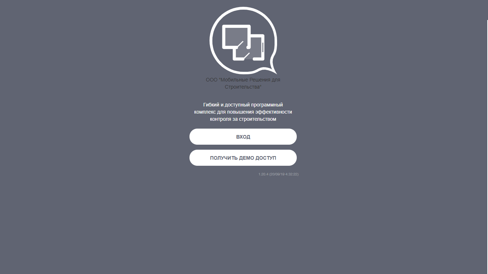
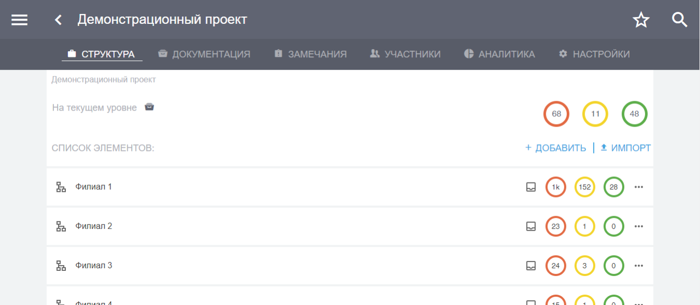

Установка программного комплекса и Вход в систему
=================================================

Установка программного комплекса
--------------------------------

Установите программный комплекс «СтройКонтроль» на свое мобильное устройство (смартфон, планшет)
и/или откройте его на персональном компьютере, воспользовавшись предложенными способами:

Для перехода в приложение для пресонального компьютера пройдите по `ссылке <https://app.plotpad.com>`_.

Ссылки на скачивание мобильного приложения:

*   `PlayMarket <https://play.google.com/store/apps/details?id=com.planstery.review&hl=ru>`_,
*   `AppStore <https://apps.apple.com/ru/app/стройконтоль/id867522092>`_.

Начало работы в программном комплексе
-------------------------------------

Интерфейс пользователя
++++++++++++++++++++++

Интерфейс пользователя доступен всем участникам проекта. 
В нем осуществляется работа непосредственно с проектом, проектной документацией, замечаниями, предписаниями, отчетами и др. 
Для входа в интерфейс пользователя:

*   на персональном компьютере пройдите по ссылке из прошлого пункта,
*   на планшете/смартфоне установите по ссылкам из прошлого пункта приложение «СтройКонтроль» и запустите его.

Далее нажмите кнопку «Вход» (Рис.1).

    Рис 1. Вход в интерфейс пользователя.

Вы попадете в меню ввода персонального интернет-адреса организации, который выдает разработчик. Адрес является уникальным для каждой организации и одинаков для всех участников проекта.
Введите адрес и нажмите кнопку «Подключится» (Рис.2).

..  figure:: ./images/installing-and-login-2-organization-code.png
    :alt: Первый экран
    :align: center

    Рис. 2. Интерфейс пользователя. Интернет-адрес организации.

В следующем меню введите свой e-mail и пароль и нажмите кнопку «Войти» (Рис. 3).

..  figure:: ./images/installing-and-login-3-logination.png
    :alt: Первый экран
    :align: center

    Рис.3 Интерфейс пользователя. Общий вид.

Вы попадете в интерфейс пользователя (Рис.4).

    Рис.4. Интерфейс пользователя. Общий вид.

Пароль для доступа в интерфейс пользователя предоставляется *администратором системы*.
Всю первоначальную настройку программы, ввод необходимых для работы данных,
создание проектов, структуры и документов производит только администратор системы.

..  note:: Администратор системы – это сотрудник клиента, имеющий расширенные права на работу с
            программным комплексом «СтройКонтроль».
            
            Он имеет право создавать проекты, структуру, загружать документацию по проекту,
            создавать пользователей и наделять их правами, создавать и присуждать сотрудникам роли на проекте и производить прочие настройки.
            По всем вопросам работы в программном комплексе обращайтесь к администратору системы.

